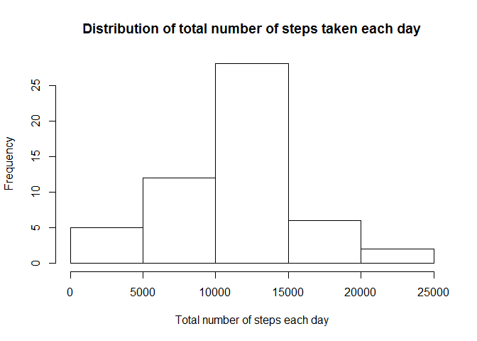
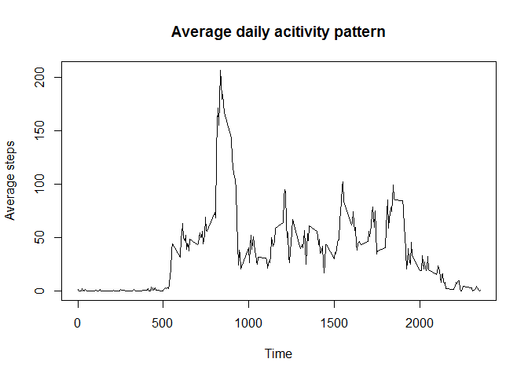
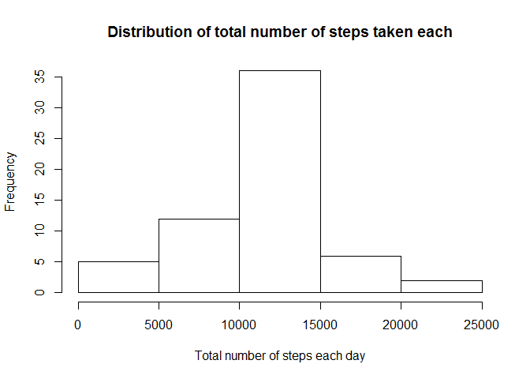
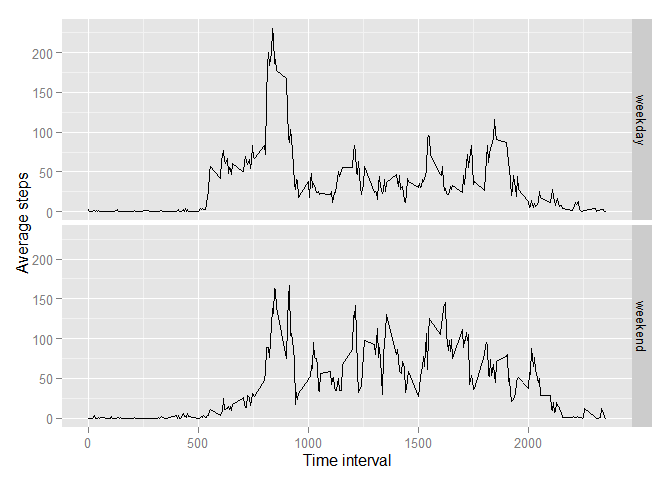

# Reproducible Research: Peer Assessment 1
Liang  
July 25, 2015  

This assignment makes use of data from a personal activity monitoring device. This device collects data at 5 minute intervals throughout the day. The data consists of two months of data from an anonymous individual collected during the months of October and November, 2012 and include the number of steps taken in 5 minute intervals each day.

## Loading and preprocessing the data
The following code can be used to load the data. I also noticed that there are `NA`s in the `steps` variable.


```r
dat = read.csv('activity.csv')
str(dat)
```

```
## 'data.frame':	17568 obs. of  3 variables:
##  $ steps   : int  NA NA NA NA NA NA NA NA NA NA ...
##  $ date    : Factor w/ 61 levels "2012-10-01","2012-10-02",..: 1 1 1 1 1 1 1 1 1 1 ...
##  $ interval: int  0 5 10 15 20 25 30 35 40 45 ...
```

```r
sum(is.na(dat$steps))
```

```
## [1] 2304
```

```r
sum(is.na(dat$date))
```

```
## [1] 0
```

```r
sum(is.na(dat$interval))
```

```
## [1] 0
```
Noticing that one whole day has 288 5-min intervals, the total number of missing `NA`s is equal to 8 days:

```r
sum(is.na(dat$steps))/288
```

```
## [1] 8
```
For now, I'll assume that there is no *isolated* missing `NA`, which means when talking about missing `NA`, that whole day has no data recorded at all. This assumption will be proved later.

For future analysis, I removed all the `NA`s together with the corresponding dates and intervals from the original data set and made a new data set by doing:

```r
idx = !is.na(dat$steps)
dat1 = data.frame(steps = dat$steps[idx], date = factor(dat$date[idx]), interval = dat$interval[idx])
str(dat1)
```

```
## 'data.frame':	15264 obs. of  3 variables:
##  $ steps   : int  0 0 0 0 0 0 0 0 0 0 ...
##  $ date    : Factor w/ 53 levels "2012-10-02","2012-10-03",..: 1 1 1 1 1 1 1 1 1 1 ...
##  $ interval: int  0 5 10 15 20 25 30 35 40 45 ...
```


## What is mean total number of steps taken per day?
I first split the data by date and calculated the total number of steps taken each day using the following code:

```r
s = split(dat1, dat1$date)
dat1sum = lapply(s, function(x) sum(x[,c('steps')]))
data_step_by_day = data.frame(date = names(dat1sum), steps = as.vector(unlist(dat1sum)))
```

The histogram of the total number of steps taken each day:

```r
hist(data_step_by_day$steps, xlab='Total number of steps each day', main='Distribution of total number of steps taken each day')
```

 

The **mean** and **median** total number of steps taken per day are: 

```r
mean(data_step_by_day$steps)
```

```
## [1] 10766.19
```

```r
median(data_step_by_day$steps)
```

```
## [1] 10765
```
I noticed that they are very close.


## What is the average daily activity pattern?
To find out the average daily activity pattern, I split the data by time intervals and calculated the average across all days.


```r
s = split(dat1, dat1$interval)
dat1ave = lapply(s, function(x) mean(x[,c('steps')]))
data_step_ave_per_int = data.frame(interval = as.numeric(names(dat1ave)), steps = as.vector(unlist(dat1ave)))
```
The time series plot is as following:

```r
plot(data_step_ave_per_int$interval, data_step_ave_per_int$steps, type = 'l',
     xlab = 'Time', ylab = 'Average steps', main = 'Average daily acitivity pattern')
```

 

The maximum number of steps and its corresponding 5-minute interval are:

```r
max(data_step_ave_per_int$steps)
```

```
## [1] 206.1698
```

```r
data_step_ave_per_int$interval[which.max(data_step_ave_per_int$steps)]
```

```
## [1] 835
```
`835` means 8:35am - 8:40am. It seems this person walked a lot during that time.

## Imputing missing values
Then I went back and took a closer look at the missing values.


```r
datNA = data.frame(date = factor(dat$date[is.na(dat$steps)]), count = rep(1, length(dat$date[is.na(dat$steps)])))
s1 = split(datNA, datNA$date)
NAcount = lapply(s1, function(x) sum(x[,c('count')]))
NA_dates = data.frame(date = names(NAcount), count = as.vector(unlist(NAcount)))
NA_dates
```

```
##         date count
## 1 2012-10-01   288
## 2 2012-10-08   288
## 3 2012-11-01   288
## 4 2012-11-04   288
## 5 2012-11-09   288
## 6 2012-11-10   288
## 7 2012-11-14   288
## 8 2012-11-30   288
```
As I expected earlier. There were total of 8 days missing, and there is not a single missing value for any of the other days.

The easiest way to fill in all of the missing values is to let them to be `0`. However, this will cause a big problem when calculating mean and median values. A better way would be to use the averaged values from the daily activity pattern above. To do so, the following code could be used:

```r
steps_filled_NA = dat$steps
steps_filled_NA[!idx] = data_step_ave_per_int$steps
dat2 = data.frame(steps = steps_filled_NA, date = dat$date, interval = dat$interval)
str(dat2)
```

```
## 'data.frame':	17568 obs. of  3 variables:
##  $ steps   : num  1.717 0.3396 0.1321 0.1509 0.0755 ...
##  $ date    : Factor w/ 61 levels "2012-10-01","2012-10-02",..: 1 1 1 1 1 1 1 1 1 1 ...
##  $ interval: int  0 5 10 15 20 25 30 35 40 45 ...
```
The same codes used before would produce the new histogram:

```r
s = split(dat2, dat2$date)
dat1sum = lapply(s, function(x) sum(x[,c('steps')]))
data_step_by_day2 = data.frame(date = names(dat1sum), steps = as.vector(unlist(dat1sum)))
hist(data_step_by_day2$steps, xlab='Total number of steps each day', main='Distribution of total number of steps taken each')
```

 

The histogram is almost identical to the one I made before. The **mean** and **median** total number of steps taken per day are: 

```r
mean(data_step_by_day2$steps)
```

```
## [1] 10766.19
```

```r
median(data_step_by_day2$steps)
```

```
## [1] 10766.19
```
Now there are the same.

The reader could try to add `as.integer()` to the following line

```r
steps_filled_NA[!idx] = data_step_ave_per_int$steps
```
to make it more realistic but the final result will be very different. The reader could also try to make all the `NA` to be 0 to see how the mean and median values would change.


## Are there differences in activity patterns between weekdays and weekends?
To label the weekends, I used the following code:

```r
datetime = strptime(dat$date, '%Y-%m-%d')
idx_weekend = (weekdays(datetime) == 'Saturday') | (weekdays(datetime) == 'Sunday')
```
I then made a new data set with a new factor variable:

```r
weekday = rep('weekday', length(datetime))
weekday[idx_weekend] = 'weekend'
dat3 = data.frame(steps = steps_filled_NA, date = dat$date, interval = dat$interval, DayType = weekday)
str(dat3)
```

```
## 'data.frame':	17568 obs. of  4 variables:
##  $ steps   : num  1.717 0.3396 0.1321 0.1509 0.0755 ...
##  $ date    : Factor w/ 61 levels "2012-10-01","2012-10-02",..: 1 1 1 1 1 1 1 1 1 1 ...
##  $ interval: int  0 5 10 15 20 25 30 35 40 45 ...
##  $ DayType : Factor w/ 2 levels "weekday","weekend": 1 1 1 1 1 1 1 1 1 1 ...
```
Because the next part of the analysis requires to split the data by two variables, it'll be much easier to use the library `plyr`:

```r
library(plyr)
result = ddply(dat3, .(DayType, interval), function(x) mean(x[,1]))
```
And the panel plot:

```r
library(ggplot2)
g = ggplot(result, aes(x = interval, y = V1))
g = g + geom_line()
g = g + xlab('Time interval') + ylab('Average steps')
g = g + facet_grid(DayType ~ .)
g
```

 

The plot indicates that it is very different in activity patterns between weekdays and weekends.

## Conclusion
The personal activity data can be used to show the activity pattern of a person. One must pay attention to the missing values. I used the averaged values from the daily activity pattern calculated without the missing values. However, a better way would be to use the corresponding weekday or weekend pattern, because there is clearly differences between weekday and weekend activity patterns.
